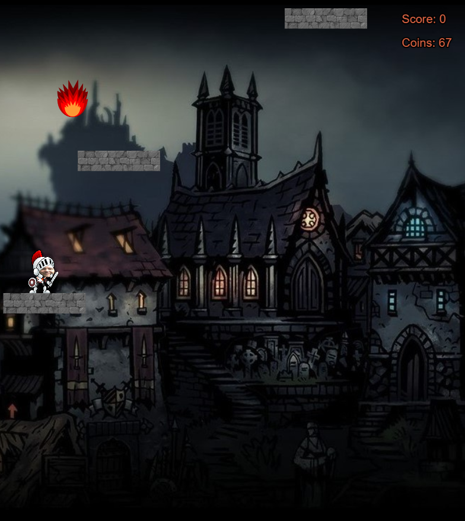

# Maximum Protection repo -- last update 10/05/2021

## Idea

Maximum Protection(tm) is a vertical platformer where you're constantly being chased by a projectile-shooting enemy. The camera will also move upwards so the player is forced to keep moving.

There are coins randomly generated across the level. The player can collect the coins and spend them on different upgrades and cosmetic changes.

After a certain height is reached a dragon will appear and the frequency of the fireballs increases.

## Theme

The original theme of the game is a knight. The background of the game starts as a dark village, but you can unlock other backgrounds.

### The characters we used

- [Dragon](https://opengameart.org/content/red-dragon)
- [Knight sprite art](https://www.gameart2d.com/the-knight-free-sprites.html)
- [Temple sprite art](https://www.gameart2d.com/temple-run---free-sprites.html)
- [Robot sprite art](https://www.gameart2d.com/the-robot---free-sprites.html)
- [Santa sprite art](https://www.gameart2d.com/santa-claus-free-sprites.html)

## Links

- [phaser](https://phaser.io/)
- [phaser boiler template with typescript](https://github.com/photonstorm/phaser3-typescript-project-template)
- [free to use game art](https://www.gameartguppy.com/)

## The game logic

- [gravity/bouncing physics](https://phaser.io/examples/v2/arcade-physics/bounce-with-gravity)
- [starstruck -- example game](https://phaser.io/examples/v2/games/starstruck)

## Screenshots from the game

### Welcome Screen

### Start of the game

### A bit further in to the game

### Character Development

## Progress

### 02/04/2021

Phaser framework working. 

### 03/04/2021 - 07/04/2021

1. Adding platforms to the game and make them spawn randomly.
2. Make sure the character jumps high enough and moves fast enough.
3. Adding a horizontal wrap in the game.
4. Adding a welcome screen to the game.
5. Adding a high score mechanic for the player.
6. Adding a coin system to the game that holds the amount that the player picked up.
7. If you fell down (didn't make it to the next platform), you automatically return to the welcome screen.
8. While working on the game, fixing bugs...

02/04/2021 -- sprite animation working
06/04/2021 -- basic controls working. Platforms, dragon and background added.

### 22/04/2021

1. Started working on the different types of sprites (robot, indy, santa,...)
2. Started working on the soundfx and background music
3. Fixed several bugs concerning the shop
4. Added fireballs and fireball logic (fireballs go faster the higher you go).

### 30/04/2021

-- Presented the idea to our teachers. Several assignments were added.
    - Add an option for playing the game with a controller
    - Personalize the game sprites

1. Finished the game music, soundfx and implemented them.
2. Shop was added
3. Backgrounds were added
4. Continued working on the different characters and backgrounds
5. Fixed several bugs

### 07/05/2021

1. Implemented the gamepad into the game
2. Continued working on the different sprites and implementing them
3. Started working on the bossfight
4. Got the bossfight working
5. Fixed several bugs while working on the game, adjustments were made to the overall difficulty.
6. Several cosmetic changes were made to the Welcome Screen

### 10/05/2021

1. Finished up the game logic
2. Started working on the presentation and the movie

## Netlify link

-[Link to game](https://maximum-protection.netlify.app/)
